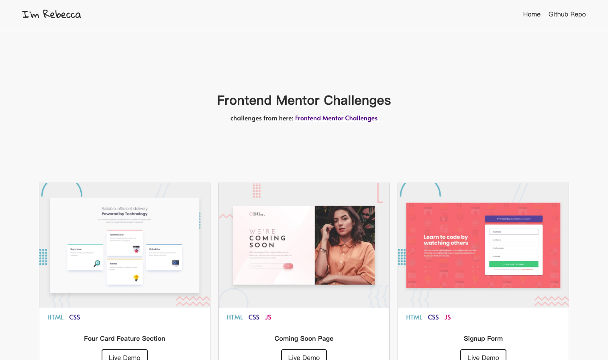

### frontend-mentor-challenges

The real-life workflow challenges from: [Frontend Mentor Challenges](https://www.frontendmentor.io/challenges)

---
my solutions: [link here](https://frontend-mentor-challenges-seven.now.sh/)



一些问题：
1. 关于首页图片```img```下部的间隙问题解决方案：[CSS 解决img底部空白间隙](https://www.jianshu.com/p/e7373c2bbef1)

2. 当输入框具有特殊样式，需要清空placeholder内的值（#3）：

scss:
```scss
input {
  border-color: red;

  &::placeholder {
    color: transparent;
  }
}
```

3. 让元素不成为鼠标的目标，点击无反应（#3 example文字提醒会阻挡鼠标点击输入框聚焦）：
[pointer-events](https://developer.mozilla.org/zh-CN/docs/Web/CSS/pointer-events)

4. CSS选择器，非第一个子元素
```css
.icon:not(:first-child) {
  margin-left: 25px;
}
```
